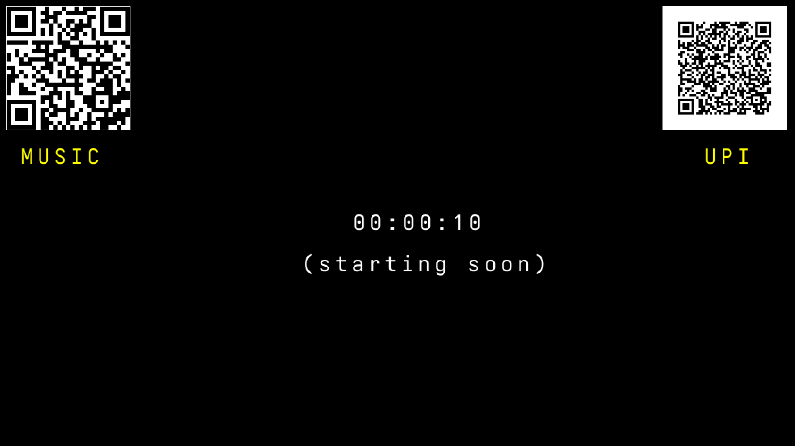

# Stream Timer



This is a basic stream timer for my twitch streams.

## Usage

```sh
./stream_timer <min/sec> <duration (int)> <caption>
```

Make sure you have `data/music` directory if you want to play the music and place your music there. Then just edit the `config.jai` file by adding your music file to `MUSIC_FILE`.


## Building

```sh
jai first.jai
```

> [!NOTE]
>
> We do not support Windows for this project


recreational programming go brrrrrrrrrrr

## Inspiration

This was inspired by tsoding's sowon2.
